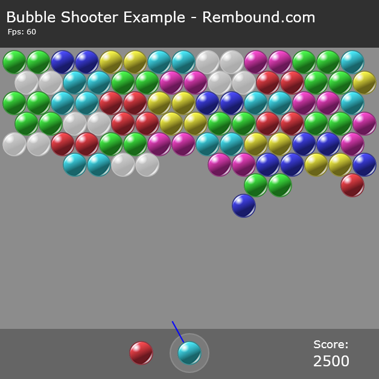

# Bubble Shooter HTML5 Game

A classic bubble shooter game built with HTML5 Canvas and JavaScript. This game features colorful bubbles, engaging gameplay, and smooth animations. Perfect for casual gaming and HTML5 game development learning.



## Description

Bubble Shooter is a popular arcade-style game where players shoot colored bubbles to match and pop groups of three or more bubbles of the same color. The game is built using HTML5 Canvas for rendering and vanilla JavaScript for game logic, making it lightweight and compatible with all modern browsers.

## Features

- Colorful bubble graphics and animations
- Intuitive mouse/touch controls
- Score tracking and high score system
- Chain reaction effects
- Responsive game board
- Classic bubble shooter gameplay mechanics
- Cross-browser compatibility
- No external dependencies

## Requirements

- A modern web browser with HTML5 support (Chrome, Firefox, Safari, Edge)
- JavaScript enabled
- No additional dependencies required

## Installation

1. Clone this repository:
   ```bash
   git clone https://github.com/yourusername/Bubble-Shooter.git
   ```
2. Navigate to the project directory
3. Open `bubble-shooter.html` in your web browser
4. No build process required - the game runs directly in the browser

## How to Play

1. Open `bubble-shooter.html` in your web browser
2. Use your mouse to aim and click to shoot bubbles
3. Match 3 or more bubbles of the same color to pop them
4. Try to clear the board while preventing bubbles from reaching the bottom
5. Chain reactions will give you bonus points
6. Game ends when bubbles reach the bottom of the screen

## Project Structure

- `bubble-shooter.html` - Main game HTML file
- `bubble-shooter-example.js` - Game logic and mechanics
- `bubble-sprites.png` - Game assets and sprites
- `screenshot.png` - Game preview image

## Credits

Created as a demonstration of HTML5 game development techniques. Special thanks to the open-source community for inspiration and resources.

## Contributing

Contributions are welcome! Please feel free to submit a Pull Request. For major changes, please open an issue first to discuss what you would like to change.

1. Fork the repository
2. Create your feature branch (`git checkout -b feature/AmazingFeature`)
3. Commit your changes (`git commit -m 'Add some AmazingFeature'`)
4. Push to the branch (`git push origin feature/AmazingFeature`)
5. Open a Pull Request

## Support

For issues or questions, please open an issue in the repository. We'll get back to you as soon as possible.

## Acknowledgments

- HTML5 Canvas API
- JavaScript community
- Open source game development community
